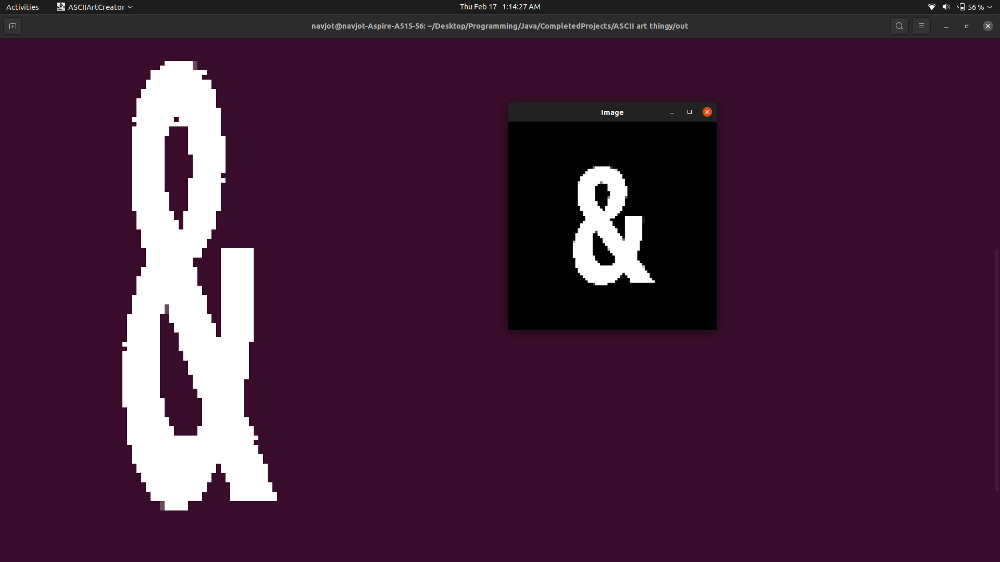
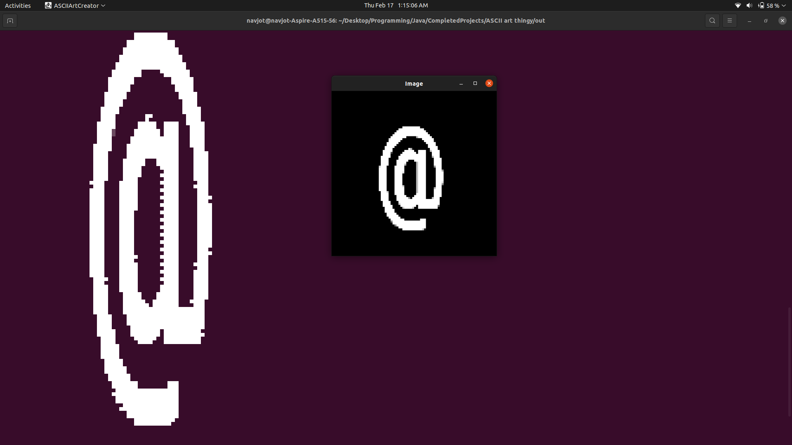
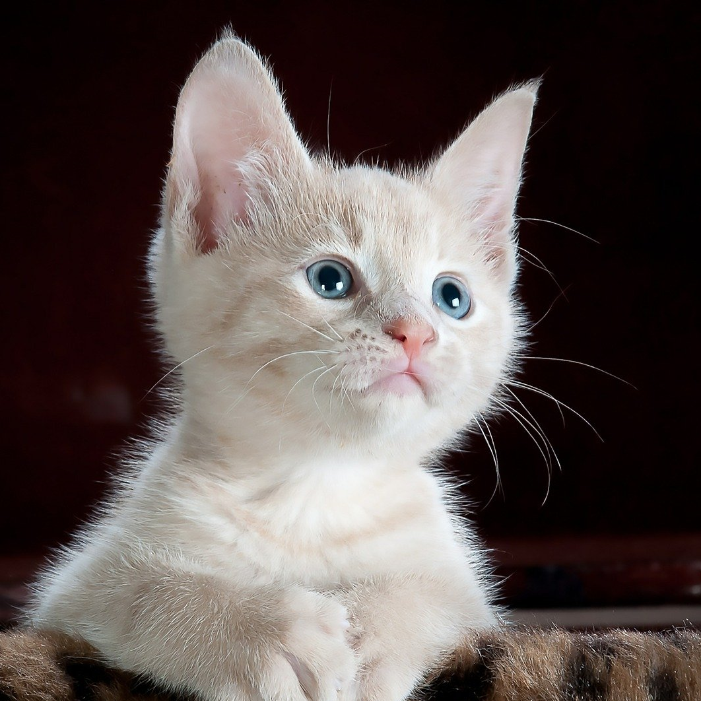
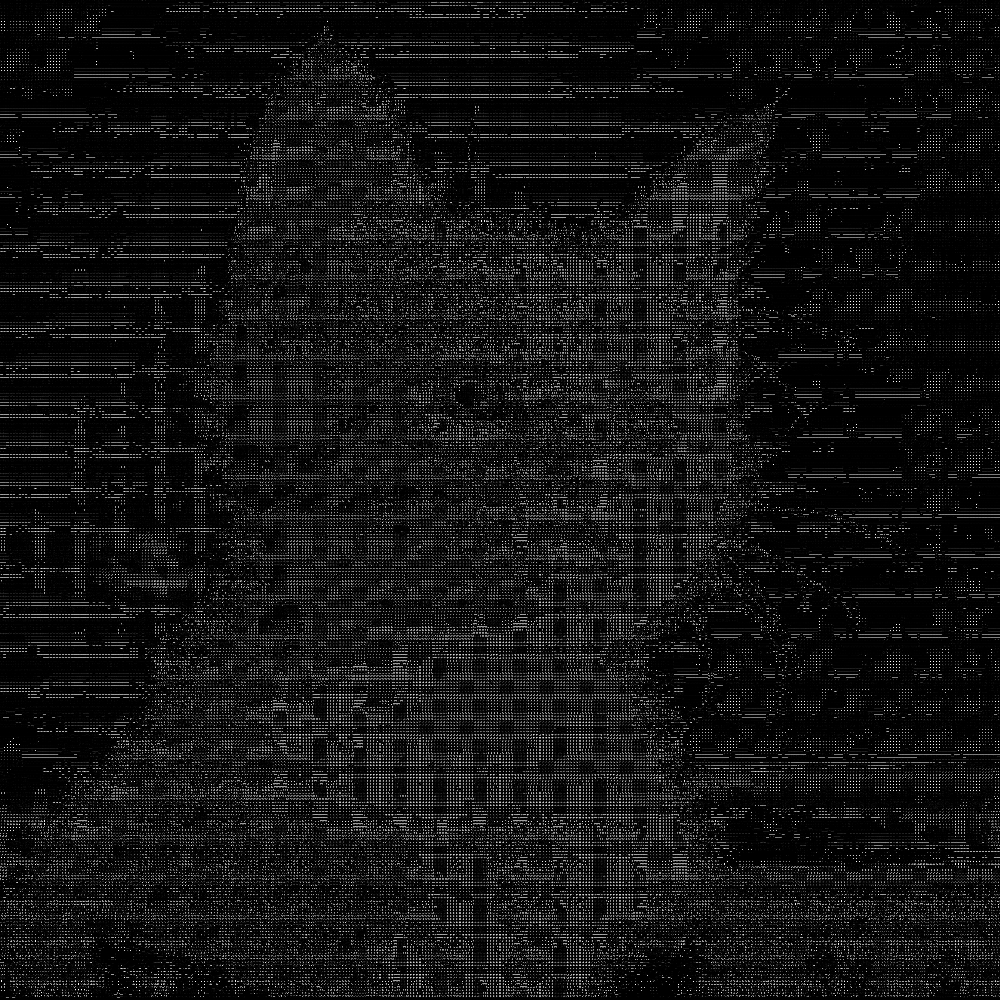

# ASCII Art Creator

## Introduction

After seeing a YouTube video by The Coding Train, I decided to make my own version of ASCII art generator. This is
designed to work in console, terminal and command prompt. I have tested it on terminal, and it works well. It takes
image path as parameter and converts the image into ASCII art.

## Usage

To use this program go to the project folder and follow the following steps:

1. ``cd ../ASCII\ art``
2. ``javac --source-path src -d . src/ASCIIArtCreator.java``
3. ``java ASCIIArtCreator -cs resources/AndSymbol.png``
    * its usage is ``java ASCIIArtCreator <options> <pixels> <path to source image>``
    * Available options :
        * ``-i : Disables the pop up of a 400x400 scaled version of selected image``
        * ``-s : Adding this option renders and saves the ASCII art as .png image``
        * ``-a : Character set 1``
        * ``-b : Character set 2``
        * ``-c : Character set 3``
        * ``-d : Character set 4``
    * Note that use **only one** of the a, b, c or d option at a time otherwise the behaviour is undefined
    * ``<pixels>``  refer to the number of pixels to which the image is to be scaled

## Technologies used

This project was created in OpenJDK 11. It has been test on Ubuntu platform using OpenJDK 11, and it works on this
platform. It should work on higher versions of JDK as well.

## Screenshots

The output with 84 pixels with no options and [AndSymbol.png](resources/AndSymbol.png)

The output with 84 pixels with no options and [AtTheRateSymbol.png](resources/AtTheRateSymbol.png)

## ASCII saved as image using ``-s`` option source and rendered images

### Image of cat

### ASCII render of the above image (325x325 characters)

### Image of penguin

### ASCII render of the above image (325x325 characters)

## Sources

* [This Image is Made of Text](https://youtu.be/55iwMYv8tGI)
  by [The Coding Train](https://www.youtube.com/c/TheCodingTrain/)

## License

MIT License

Copyright (c) 2022 Navjot Singh Rakhra

Permission is hereby granted, free of charge, to any person obtaining a copy of this software and associated
documentation files (the "Software"), to deal in the Software without restriction, including without limitation the
rights to use, copy, modify, merge, publish, distribute, sublicense, and/or sell copies of the Software, and to permit
persons to whom the Software is furnished to do so, subject to the following conditions:

The above copyright notice and this permission notice shall be included in all copies or substantial portions of the
Software.

THE SOFTWARE IS PROVIDED "AS IS", WITHOUT WARRANTY OF ANY KIND, EXPRESS OR IMPLIED, INCLUDING BUT NOT LIMITED TO THE
WARRANTIES OF MERCHANTABILITY, FITNESS FOR A PARTICULAR PURPOSE AND NONINFRINGEMENT. IN NO EVENT SHALL THE AUTHORS OR
COPYRIGHT HOLDERS BE LIABLE FOR ANY CLAIM, DAMAGES OR OTHER LIABILITY, WHETHER IN AN ACTION OF CONTRACT, TORT OR
OTHERWISE, ARISING FROM, OUT OF OR IN CONNECTION WITH THE SOFTWARE OR THE USE OR OTHER DEALINGS IN THE SOFTWARE.
___